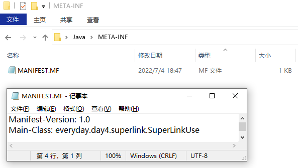

# Java学习记录


### DAY1

#### 汽车的封装和内存布局encapsulation


#### java的idea，新建Java类时，自动在文件头中添加作者名和日期时间等信息

https://blog.csdn.net/weixin_44076342/article/details/106789384

### DAY2

#### 2.1包的概念和命名规则
(1) 一个类里面不仅可以new自己，还可以new别的类。

(2) 包就是一个文件夹，给类分类，更好管理代码

(3) 包名用小写

(4) 类的全限定名称 a.b.everyday.day1.Car//包名.包名.....类名

(5) 包的命名规则，域名倒置，建文件夹的时候很舒服。例如，com一级目录，百度二级目录，文库、知道等三级目录

#### 2.2引入其它包的类
(1) 将全限定名称通过import的方式导入

(2) 推荐用那个类就把哪个类引入


### DAY3

#### 3.1权限修饰符

|      作用域       | 当前类 | 同Package | 子孙类 | 其它Package |
| :---------------: | :----: | :-------: | :----: | :---------: |
|      public       |  True  |   True    |  True  |    True     |
|     protected     |  True  |   True    |  True  |    False    |
| friendly(default) |  True  |   True    | False  |    False    |
|      private      |  True  |   False   | False  |    False    |


#### 3.2构造器

(1) 写在成员变量后面

(2) this能被当做构造器使用，this永远指向调用或构造的当前实例

#### 3.3getter和setter

(1) 别人不能直接修改成员变量，只能通过getter和setter修改
(2) 快捷键Alt + Insert

#### 3.4写对象的过程
(1) 第一块内容：成员变量
(2) 第二块内容：写构造器、记得补无参构造
(3) 第三块内容：成员方法
(4) 第四块内容：getter和setter
(5) main方法不写在这里

#### 3.5String
(1) final修饰的变量不能改变
(2) playString 构造方法
(3) String 的内存分析和笔试题

### DAY4--1

#### 4.1转义符‘\’

#### 4.2统计单词出现次数

#### 4.3包装类和自动拆装箱

#### 4.4Integer的笔试题-128到127

#### 4.5超级数组（superArray）

#### 4.6超级链表

#### 4.7快捷键修改“setting”---“Keymap”---“General...”

### DAY4--2 基于超级链表(数组)实现栈和队列

#### 4.1超级链表代码优化

#### 4.2超级链表排序(新能对比)

#### 4.3基于超级数组实现队列和栈

(1)栈：先进后出(压栈、弹栈) 桶

(2)队列：先进先出(入队、出队) 排队

#### 4.4基于超级数组实现队列和栈


#### 4.5打包(jar包)

"File"---"Project Structure"---"Artifacts"---"JAR"---"From modules..."

"Build"---"Build Artifacts..."---"选择jar包"---"Build"

"File"---"Project Structure"---"module"---"选择要引入jar包的工程文件"---"+"---"选择jar包"

"META-INF"为指定的main方法




#### 4.6基于队列实现一个银行取票机小系统


#### 4.7修改类名(对着代码里类名按Shift + F6)

(1) [快捷键] 取消缩进(Shift + tab)


### DAY4--3 面向对象之继承


#### 4.1 子类能用父类的方法，同时用于自己的特性


#### 4.2 子类和父类的构造顺序(创建子类一定会创建它的父类)


#### 4.3 super关键字

(1) 使用super调用父类的方法和属性

(2) 基本同this关键字

(3) 构造器前不能加任何代码，所以也不能有两个构造器


#### 4.4 super和this关键字的区别

(1) 所有类都继承自一个Object的超类,可以使用其中的特殊方法

(2) 构造器不会向上检索

#### 4.5 方法重写

(1) 加入注解“@Override”

(2) 重写和重载的区别


#### 4.6 final关键字

(1) final 修饰类，类不能继承

(2) final 修饰方法，方法不能重写

(3) final 修饰变量，基础数据类型，值不能改变；引用数据类型，地址空间不能改变，实列能变

### DAY4--4 Object

#### 4.1 Object类(祖先类)

- 所有的类，默认继承自祖先类

(1) 11个方法，8个公共方法

#### 4.2 hashcode
- 简单的例子：对10取余运算

(1) 散列，音译过来hash， 将任意长度的输入，通过散列算法，变成固定长度的输出，输出的值就是散列值

(2) 一个好的哈希算法，原文发生微小的改变，散列值发生巨大变化

(3) 一个好的哈希算法，还能尽量避免发生hash值重复的情况，也叫hash碰撞

(4) hash用途：a.密码保存 b.文件的校验 c.检测数据的一致性

##### 常见的Hash摘要算法

###### MD5

通过算法的名字，得到一个算法的实例，再使用算法的方法进行哈希散列。

##### hash算法和String的hash

hashCode()中为什么是31作为乘数，31*h+val[i]

(1) 奇质数，偶数容易溢出 (2) 31*h = (h << 5) - h,jvm里面优化，位运算的效率高。

(1)实用角度，31作为乘数，碰撞发生的次数少,用例说明：首先生成5000个随机的长度为1000的字符串，String为引用数据类型，直接使用hashCode函数会调用Object类里面的hashCode函数，不管怎么改变String的值，hash值不会发生变化，因此重新写了一个hashCode模拟了这个过程，得到的结果是，再31附近的几个数组，31的碰撞次数最少。

#### equal

(1) ==和equals区别， ==比较基础数据类型，也可以比较引用数据类型，基础数据类型比较的是值，引用数据类型比较的是内存地址。

(2) equals是Object类中的一个方法，默认实现的是==

(3) 我们可以重写equals方法，像String中就重写了equals方法，所有字符串中的equals比较的是每一个字符。

#### finalize

(1) java提供finalize()方法，垃圾回收器准备释放内存的时候，会先调用finalize()。

(2) 垃圾回收和finalize()都是靠不住的，只要JVM还没有快到耗尽内存的地步，就不会浪费时间进行垃圾回收。

(3) "@Deprecated(since="9")"注解表示已经过时了


#### toString()

(1) String类中重写了toString方法，打印时，输出结果时自己

(2) 其它类中，调用的是Object类中的方法，全限定名称 + ”@“ + 十六位的内存地址

#### clone()

(1) Object类中的clone是浅拷贝，工作中不怎么用

(2) 浅拷贝只拷贝第一层的对象，不拷贝对象中的引用对象， 当我们修改拷贝对象中的引用对象时，原对象的引用对象也会发生变化。


### DAY5---1 polymorphism 多态

#### 宏观上来讲

现在有一个宠物类，宠物类中有一个方法叫宠物在吃饭。猫和狗都可以作为宠物饲养，但猫要吃猫粮，狗要吃狗粮。有个小女孩要喂养她的宠物，这个宠物可以是猫也可以是狗。从上述行为中我们总结了多态形成的三个条件。
(1) 有继承，猫和狗都继承自宠物。
(2) 有重写，猫要吃猫粮，狗要吃狗粮。
(3) 父类应用指向子类对象，小女孩喂养宠物，这个宠物是狗也可以是猫。

#### 多态的底层原理
字节码---Out文件中找到class文件---通过UE查看16进制数

在java中，对其右键，选择”open in“---"Terminal"---键入指令”javap -v .\Computer.class“

~~**** 找时间再看一次多态的内容 ****~~


### DAY5---2 抽象类和接口

(1) 面向程序设计(OOP)三大特性：封装、继承、多态。

(2) 接口是多实现的，一个类可以有多个接口。但是只能继承一个类。

(3) 接口之间可以相互继承。

(4) 继承是is-a的关系，dog is an animals;

(5) 实现是can do的关系，飞机能飞、鸟能飞

(6) String 实现了 java.io.Serializable, Comparable<String>, CharSequence---序列化(变成二进制流的方式)、可比较、一个可读的序列

(7) 抽象类是模板式的设计、接口是契约式的设计。


### DAY5---3 软件设计原则

- 设计模式是人们为软件开发中相同表征问题，抽象出的可重复利用的解决方案。在某种程度上，设计模式已经代表了一些特定情况的最佳实现，同时也起到了软件工程师之间沟通的”行话“的作用。理解和掌握典型的设计模式，有利于我们提高沟通、设计的效率和质量。


#### 5.1 面向对象设计原则

(1) 开闭原则

- 对拓展开放，对修改关闭
- 通过抽象约束、封装变化来实现。
- 即通过接口或者抽象类为软件实体定义一个相对稳定的抽象层，而将相同的可变因素封装在相同的具体实现类中。
- 从抽象类中派生一个实现类 --- 当软件需要发生变化时，只需要根据需求重新派生一个实现类来拓展即可

(2) 里氏代换原则

- 子类继承父类时，除添加新的方法完成新增功能外，尽量不要重写父类的方法

(3) 依赖倒转原则

- 要面向接口编程，不要面向实现编程

1.每个类尽量提供接口或抽象类，或两者都具备

2.变量的声明类型尽量是接口或者是抽象类

3.任何类都不应该从具体类派生

4.使用继承时，尽量遵循里式替换原则


(4) 接口隔离原则

- 要求程序员尽量将臃肿庞大的接口拆分成更小的和更具体的接口，让接口只包含客户感兴趣的方法。

(5) 迪米特法则(最少知道原则)
- 只与你的直接朋友交谈，不跟“陌生人”说话（Talk only to your immediate friends and not to strangers）。其含义是：如果两个软件实体无须直接通信，那么就不应当发生直接的相互调用，可以通过第三方转发该调用。其目的是降低类之间的耦合度，提高模块的相对独立性。


(6) 合成复用原则

- 原则是尽量使用合成/聚合的方式，而不是使用继承。如果要使用继承关系，则必须严格遵循里氏替换原则。合成复用原则同里氏替换原则相辅相成的，两者都是开闭原则的具体实现规范。

(7) 单一原则
- 一个类只做一件事情


### DAY6---1 模板方法设计模式

(1) 所有需要子类具体实现的方法都用抽象类定义

(2) 所有子类中必须实现的方法都定义在父类里面 //流程类的过程，子类不需要知道具体的实现流程

### DAY6---2 策略设计模式

(1) 面向顶层设计

(2) 解耦合

(3) 开闭原则

### DAY6---3 静态代码块和示例代码块

(1) 实例代码块默认放到无参构造器中实现

(2) 各种代码块的指向顺序

(3) 静态代变量和成员变量的赋值

#### 静态代变量和成员变量的赋值

(1) 静态变量的使用，<类名. + 变量名>

(2) 静态方法的使用，<类名. + 方法名>

(3) 静态的变量或者静态的方法是存在方法区的，其他的方法也在方法区（永久带，元空间）。


#### 静态方法和成员方法

(1) 调用实例方法一定要new对象。也就是一定要有主体，不能直接当做参数使用，也不能直接调用。

(2) 在一个类中直接调用时，省略了this，而在静态方法中没有this，所以在静态方法中调用实例方法，必须new一个对象。

(3) 静态方法无论在那里都是类名.方法名调用，同一个类的静态方法之间可以相互调用，忽略类名，但建议写上。


#### 静态方法和静态常量的使用场景

(1) 使用静态方法完成一些工具性质的类

(2) 静态常量+final关键字修饰，可以定义一些静态常量

(3) 静态常量，字母全部大小

(4) 一处修改，处处修改(好记)


#### 内部类

(1) 80%都是静态内部类

#### 单例设计模式 懒汉和饿汉

(1) 饿汉--一开始就完成初始化； 懒汉--只要使用时才会开辟一个新的空间进行使用。

#### 静态内部类实现单例

#### 匿名内部类

(1) 实现接口的匿名内部类

(2) 匿名(继承父类)子类


#### 箭头函数和函数式接口

- 看day6 arrow的package，应用在strategy中的client

(1) 实现上同匿名内部类，当接口只有一个函数时，可以简化，return只有一个语句时，也可以简化，简化的结果同上。


#### 值传递和所谓的传递引用 --- delivery

(1) Java里面一般只有值传递

(2) 传入的对象不是之前那个对象，只是一个值的拷贝，像引用对像String就会拷贝它的地址，在进行赋值时，在方法区的常量池中分配一个空间给它，对原地址的值没有改变。

(3) 在类中，拷贝的是地址，setName是直接对该地址上的值进行修改，但是new一个空间，会将该空间的地址赋值给拷贝的对象，没有对原来地址上的值进行修改。

#### main方法深入

(1) main方法是所有程序的入口

(2) 可以有很多main方法，执行时只能从一个main方法进入。

(3) Client.java import
$ javac Client.java
$ java Client 1 2 3 4 5 参数

### DAY7---1 JVM

- 编译型还是解释型？

(1) java 是 编译型和解释性，javac将程序编译成字节码文件，字节码文件在Jvm中一行一行的执行

(2) JIT 即使编译器 吞吐量高、有运行时的性能加成、可以跑的很快、能做到动态生成代码、但启动速度慢、并需要一定时间和频率才能触发JIT的分层机制。

(3) AOT 编译器将源代码直接编译成本地机器码

(4) 前端 编译器，像Javac 将程序编译成字节码文件

- 动态类型还是静态类型？

(1) 静态类型语言，强类型定义语言


#### 计算一个对象在内存的大小


#### 类的加载


#### 垃圾回收
程序的绝大部分时朝生夕死，对使用过以后不再使用的对象，需要从堆内存中清除。栈内存是不需要清除数据的。栈的数据特点，一个数据从栈中弹出后，数据自然就被清理掉了，当然方法区存有我们的元数据，这些数据也是不需要清理的。

(1) 引用计数器法（会造成循环引用的问题）

(2) 根可达算法，通过一系列的称为"GC Roots" 的对象作为起始点，从这些节点向下搜索，搜索走过的路径称为引用链，当一个对象到“GC Root“没有任何引用链时，证明此对象不可用。解决了循环引用的问题。

- 在Java语言中，可作为”GC Roots“的对象包括以下几种：
- 虚拟机栈(栈帧中的本地变量表)中引用的对象
- 方法区中类静态属性引用的对象
- 方法区中常量引用的对象

#### 垃圾回收算法(4种)

(1) 标记-清除算法 (先标记，后清除。产生大量内存碎片)

(2) 复制算法 (堆空间分成两块，有用的复制到另一边；空间换时间)

(3) 标记整理算法 (标记清除后，将碎片补上；进行较多复制操作，效率会变低)

(4) 分代收集算法 (结合了复制算法和标记整理算法的优点，分为年轻代（频繁的更迭，使用复制算法、空间换时间）和老年代(长久存在，使用标记整理算法、时间换空间))

#### 垃圾回收器(小程序，集成在jdk)


### DAY7---2 API

- API (Application Programming Interface) 应用程序接口，是一些预先定义的接口。
- JDK 能够提供给我们使用的类的接口方法

#### Date

#### Calendar

#### simpleDateFormat时间格式化器

#### instance (推荐使用，看实际工作需求)

#### LocalDate详解

Duration(持续时间) 是TemporalAmount(时间量) 的子类。

主要用在instant的日期计算

#### DateTimeFormatter(线程安全的，推荐使用)


#### Math BigDecimal Random(加种子：一直使用下去就是随机，重复使用种子的生成随机数结果相同)

#### Arrays


#### System

#### StringBuilder和StringBuffer***

(1) StringBuffer是线程安全的，效率低。

(2) StringBuilder是非同步的，可以不需要额外的同步于多线程中。


### DAY8---1 error
- Throwable 异常的父类

(1) OutOfMemoryError 内存溢出错误


(2) StackOverflowError 栈内存溢出错误


(3) NoClassDefFoundError 找不到class定义错误


### DAY8---2 Exception
异常链

### DAY8---3 泛型，泛型方法


### 泛型通配符
无界 "?"可以接收任何类型
```java
    public static void printSuperArray(SuperArray<?> superArray){
        for (int i = 0;i<superArray.size();i++){
            System.out.println(superArray.get(i));
        }
    }
```

上界 (SuperArray<? extends Dog> superArray)的形式来约定传入参数的上界，意思就是泛型只能是Dog的或者Dog的子类。
```java
    public static void printSuperArray(SuperArray<? extends Dog> superArray){
        for (int i = 0;i<superArray.size();i++){
            System.out.println(superArray.get(i));
        }
    }
```

下界  我们可以使用(SuperArray<? super Dog> superArray)的形式来约定传入参数的下界，意思就是泛型只能是Dog的或者Dog的超类
```java
    public static void printSuperArray(SuperArray<? super Dog> superArray){
        for (int i = 0;i<superArray.size();i++){
            System.out.println(superArray.get(i));
        }
    }
```


#### 类型擦除

(1) 泛型不能是基本数据类型

(2) 重载方法，如果泛型类型因为具体的泛型不同而导致方法签名不同，那么以下两个方法就是两重载方法

#### 类型擦除和多态的冲突

父类在类型擦除后，为Object类，子类在继承父类时指定了泛型的具体类型，导致重写的方法看上去是重载，JVM中使用了桥接的方法，找到子类方法中同名的参数为Object方法去实现了重写。


#### 静态和泛型

```java
public class Test<T> {
	privat T
	t;
	private static T s;//会出错，静态常量在类加载时初始化，在static代码块中赋值，但泛型在创建对象或调用方法时明确类型，所以在静态常量中不能使用泛型
    // 静态方法在调用时传参，可以明确类型
}
```